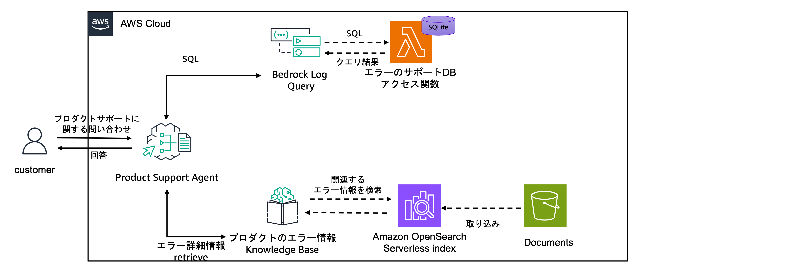

# Agent Preparation Toolkit (APT)

## これは？
生成 AI における Agent をすぐに体感できるサンプル実装です。
Amazon Bedrock Agents を使ってすぐに Agent を動かすことができるほか、使用している Knowledge Bases のデータや Lambda 関数を差し替えたり付け加えたりすることで自社用の Agent に改造できます。

## 使い方

> [!NOTE]
> AWS のリージョンは `us-west-2` で動作確認しています。

> [!NOTE]
> デプロイする環境で docker daemon が動いている必要があります。  
> [colima](https://github.com/abiosoft/colima) で動作を確認しています。
> 事前に `colima start` をしておいてください。

```shell
# リポジトリの Clone
git clone https://github.com/aws-samples/agent-preparation-toolkit

# カレントディレクトリをリポジトリに移す
cd agent-build-kit

# パッケージのインストール
npm install && cd custom-resources && npm ci && cd ..

# CDK Bootstrap
cdk bootstrap

# Agent のデプロイ
npm run cdk:deploy

# (待つ)
# CDK の出力にあるStackName = の後ろの値をコピーする
# 例: Dev-AgentPreparationToolkitStack.StackName = Dev-AgentPreparationToolkitStack

# DataSource の同期 
# {YOUR_STACK_NAME} には Dev-AgentPreparationToolkitStack などを入力
python 1_sync.py -s {YOUR_STACK_NAME} # DataSource の同期が走る

# Agent 呼び出しサンプル
python 2_invoke.py 
```

## プリセットの Agents

これらの Agent は `lib/agents-preparation-toolkit-stack.ts` の各 Agent 定義部分をコメントアウトすることでそれぞれ無効化することができます。  
必要なものだけをご利用ください。

### Python Coder
ユーザーは Python Coder にコーディングして欲しい内容を与えると、Python Coder は自分でコードを書き、自動でテストし、コードとテスト結果を返します。  
試しに `３次元ベクトルの外積を計算するコードを書いて` などと依頼するとその通りのコード及びテストコードと結果を返してくれます。  
  

コードは単一ファイルで実行できる前提で、リポジトリ丸ごと作成する処理はできません。


### Human Resource Agent
Knowledge Base に会社の年休付与規則と Database (Lambda 内で動く SQLite) に社員の入社日が格納されています。  
各社員の今年の年休付与日数を問い合わせることができます。
試しに `Kazuhito Go の今年度の年休付与日数は？` と問い合わせると、本日の日付を取得して Kazuhito Go の入社日から在籍日数を計算し、Knowledge Base から年休付与日数を算出します。


### Product Support Agent
プリンタのエラーコードを持つ Knowledge Base と、Database (Lambda 内で動く SQLite) にエラーコードごとの対応履歴が格納されています。  
エラーコードを与えるとどんなことをすれば直る可能性があるかを教えてくれます。
試しに `E-03` と検索すると、過去の E-03 の詳細及び過去の対応から何をすればいいかを出力します。



> [!IMPORTANT]
> Human Resource Agent 及び Product Support Agent には Amazon Bedrock Agents で LLM が SQL を考えて Action Group に登録されている AWS Lambda の Lambda 関数が SQL を実行する仕組みが入っています。  
> 本サンプルでは Lambda 関数上に立てている SQLite の DB に対してクエリを投げており、Lambda 関数上で INSERT や DROP の命令を除外する仕組みが入っています。  
> 実際には RDS や Athena などの DB に対してクエリを投げるはずですが、そのときは Lambda のロールや、DB のユーザーに対して、SELECT (READ) 系の実行しかできないよう権限の制御をかけてください。

## Generative AI Use Cases JP (通称: GenU) 連携
このリポジトリに GUI は無いですが、[AWS マネジメントコンソールの GUI](https://us-west-2.console.aws.amazon.com/bedrock/home?region=us-west-2#/agents) を使うことができる他、[GenU](https://github.com/aws-samples/generative-ai-use-cases-jp) を利用することで、簡単に GUI を作成できます。  
(上記のスクリーンショットは GenU を用いたものです)  
`1_sync.py` を実行したあと、`genu.json` という json ファイルが出来上がります。  
GenU の `./packages/cdk/parameter.ts` もしくは `./packages/cdk/cdk.json` の agents パラメータの配列の中に json ファイルの中身を格納してください。  
詳細は [手動で作成した Agent を追加](https://github.com/aws-samples/generative-ai-use-cases-jp/blob/main/docs/DEPLOY_OPTION.md#%E6%89%8B%E5%8B%95%E3%81%A7%E4%BD%9C%E6%88%90%E3%81%97%E3%81%9F-agent-%E3%82%92%E8%BF%BD%E5%8A%A0) を参照ください。

## 削除
以下コマンドで削除してください。  

```shell
npm run cdk:destroy
```